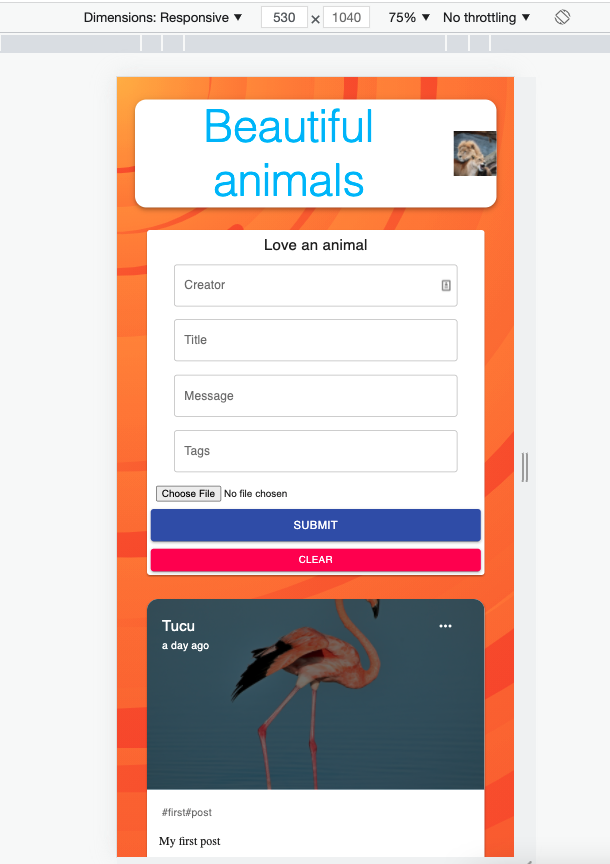
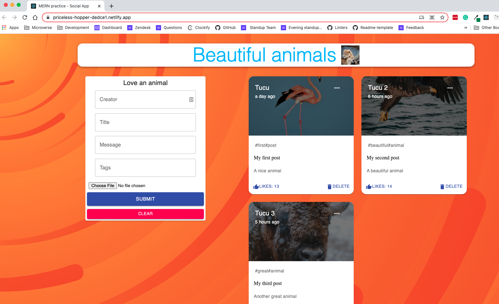
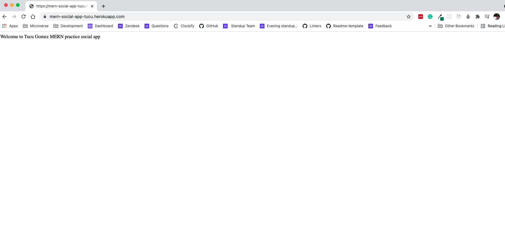

# MERN Social App

## Objective

This project intends to give me my first steps into developing a full MERN application.

## Next Steps

- Update the app with user login

## Live link

Visit [MERN social app](https://priceless-hopper-dedce1.netlify.app/).
The backend is hosted in Heroku. You can get to the API [here](https://mern-social-app-tucu.herokuapp.com/)

## Screenshots

## Repository

- You can find the repo [here](https://github.com/MiguelArgentina/mern-media-app). IT contains the `client` folder with all the front-end code and the `server` folder with all the back-end code.

## Built With
React, Node.js, Express & MongoDB
- Node.js
- React
- React-DOM
- Create-React-App
- Heroku Buildpack for create-react-app
- npm
- Javascript ES6+Jest
- CSS
- Material UI

## Author

👤 &nbsp; **Miguel Ricardo Gomez**

- GitHub: [@MiguelArgentina](https://github.com/MiguelArgentina)
- Twitter: [@Qete_arg](https://twitter.com/Qete_arg)
- LinkedIn: [Miguel Ricardo Gomez](https://www.linkedin.com/in/miguelricardogomez/)

 

## Show your support

Give a ⭐️ &nbsp; if you like this project!

## Acknowledgments

- This project was bootstrapped with [Create React App](https://github.com/facebook/create-react-app)
- Thanks to [JavaScript Mastery](https://www.youtube.com/channel/UCmXmlB4-HJytD7wek0Uo97A) for his excellent [MERN tutorial](https://www.youtube.com/watch?v=ngc9gnGgUdA&list=PL6QREj8te1P7VSwhrMf3D3Xt4V6_SRkhu). 

## License

Available as open source under the terms of the [MIT License](https://opensource.org/licenses/MIT).